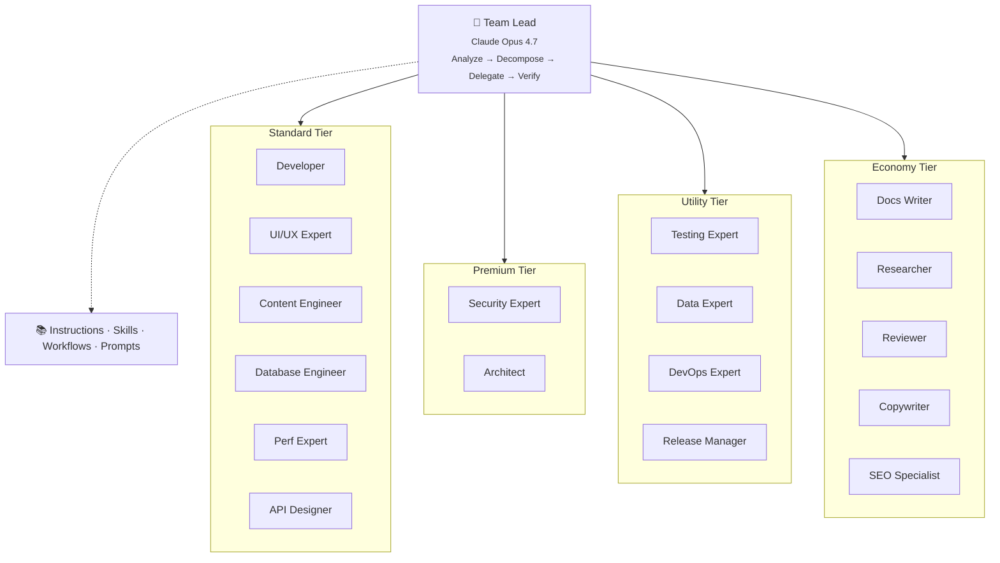
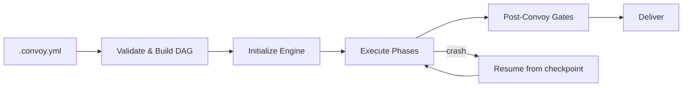

# Architecture

> Back to [README](README.md)

OpenCastle turns AI coding assistants into multi-agent teams. A **Team Lead** agent decomposes work, delegates to specialist agents, and verifies results through layered quality gates — all orchestrated via the `opencastle` CLI.

---

## System Overview



---

## Model Tiers

| Tier | Model | Use case |
|------|-------|----------|
| Premium | Claude Opus 4.7 | Architecture, security, orchestration |
| Standard | Gemini 3.1 Pro | Features, schemas, UI |
| Utility | GPT-5.5-Codex | Testing, data, deployment |
| Economy | GPT-5.4 mini | Documentation |

---

## Execution Modes

The Team Lead operates in two modes depending on task complexity:

| Mode | When | Mechanism | Parallelism |
|------|------|-----------|-------------|
| **Compact** | Score ≤2, single subtask | Inline `runSubagent` calls | Sequential |
| **Convoy** | Score 3+ or multi-task | `.convoy.yml` spec → ConvoyEngine | Parallel (DAG-based) |

**Compact mode** handles small, focused tasks synchronously within a single conversation. The Team Lead delegates to one specialist at a time, reviews the output, and moves on.

**Convoy mode** is the structured execution engine for complex, multi-step work. See [Convoy Architecture](#convoy-architecture) below.

---

## Agents

19 specialist agents, each with a defined scope, output contract, and file partition boundary.

| Agent | Domain |
|-------|--------|
| Team Lead | Orchestration — never writes code |
| Developer | Pages, components, routing, API routes, server logic |
| UI/UX Expert | Accessible, consistent UI components and design system |
| Architect | Strategic architecture decisions, ADRs, system design |
| Security Expert | Auth, authorization, RLS, security headers, input validation |
| Testing Expert | E2E tests, integration tests, browser validation |
| Database Engineer | Migrations, access policies, schema changes |
| Content Engineer | CMS schemas, content types, queries |
| Data Expert | ETL pipelines, scrapers, CLI tools, data import |
| DevOps Expert | Deployments, CI/CD, cron jobs, environment variables |
| Performance Expert | Frontend/backend/build performance optimization |
| API Designer | Route architecture, endpoint conventions, API docs |
| Release Manager | Pre-release verification, changelogs, version management |
| Documentation Writer | Project docs, roadmaps, technical guides |
| Researcher | Deep codebase exploration, pattern discovery, git archaeology |
| Reviewer | Mandatory fast validation after every delegation |
| Copywriter | UI microcopy, marketing text, error messages |
| SEO Specialist | Meta tags, structured data, sitemaps, crawlability |
| Session Guard | Compliance check — verifies logs, lessons, quality gates |

---

## Knowledge System

```
src/orchestrator/
├── agents/          # Agent definitions (.agent.md)
├── skills/          # Reusable domain expertise (28 skills)
├── instructions/    # Cross-cutting guidelines
├── snippets/        # Canonical rules (DRY — referenced via Inherits:)
├── agent-workflows/ # Multi-step workflow templates
├── prompts/         # Prompt templates
├── plugins/         # IDE marketplace plugins
└── customizations/  # Project-specific overrides
```

**Skills** are on-demand knowledge modules loaded by agents when entering a specific domain. Examples: `react-development`, `security-hardening`, `testing-workflow`, `observability-logging`.

**Snippets** are canonical rule definitions (e.g., secret scanning, output contracts, discovered-issues policy). Agents and skills reference them via `> Inherits: [rule-name](path)` pointers instead of duplicating content.

---

## Adapters

OpenCastle generates agent definitions for multiple IDE formats via pluggable adapters:

| Adapter | IDE |
|---------|-----|
| `vscode` | GitHub Copilot (VS Code chat participants) |
| `cursor` | Cursor AI |
| `claude-code` | Claude Code |
| `opencode` | OpenCode |
| `windsurf` | Windsurf |
| `codex` | Codex CLI |
| `antigravity` | Antigravity |

Convoys can mix adapters in a single run — each task is assigned to an adapter independently.

---

## Workflow Templates

| Template | Flow |
|----------|------|
| `feature-implementation` | DB → Query → UI → Tests |
| `bug-fix` | Triage → RCA → Fix → Verify |
| `data-pipeline` | Scrape → Convert → Enrich → Import |
| `security-audit` | Scope → Automate → Review → Remediate |
| `performance-optimization` | Measure → Analyze → Optimize → Verify |
| `schema-changes` | CMS model modifications and queries |
| `database-migration` | Migrations, access policies, rollback |
| `refactoring` | Safe refactoring with behavior preservation |

---

## Quality Gates

| Gate | Method |
|------|--------|
| **Deterministic** | Lint, type-check, unit tests, build verification |
| **Fast review** | Mandatory single-reviewer sub-agent after every delegation, with automatic retry and escalation |
| **Panel review** | 3 isolated reviewer sub-agents, 2/3 majority wins (high-stakes or escalation) |
| **Structured disputes** | Formal dispute records when automated resolution is exhausted — packages both perspectives for human decision |
| **Browser testing** | Chrome DevTools MCP at project-defined responsive breakpoints |
| **Secret scan** | Post-execution scan for leaked credentials (API keys, tokens, passwords) |
| **Blast radius** | Detects risky file patterns (migrations, auth changes, RLS policies) |
| **TDD gate** | New source files must have corresponding test files |

---

## Convoy Architecture

A **convoy** is the structured execution engine for multi-agent workflows. It provides deterministic, crash-recoverable orchestration with file isolation, DAG-based scheduling, and layered validation.

### Lifecycle



1. **Spec** — A `.convoy.yml` file defines tasks, agents, file partitions, dependencies, and orchestration rules
2. **DAG validation** — Tasks form a directed acyclic graph; phase assignment is computed from dependencies
3. **Initialization** — Engine creates convoy record in SQLite (`.opencastle/convoy.db`), starts health monitor, configures event emitter
4. **Execution** — Tasks run phase-by-phase; within a phase, up to `concurrency: N` tasks run in parallel
5. **Completion** — Post-convoy gates run, convoy guard validates logs, worktrees are cleaned up
6. **Recovery** — On crash, `resume(convoyId)` replays from the last checkpoint using SQLite + NDJSON recovery

### Per-Task Execution

Each task follows this flow:

```
Check dependencies → Resolve upstream outputs → Build isolation preamble
→ Assign to adapter → Execute with timeout → Run post-execution gates
→ Validate output contract → Run review → Update status → Emit events
```

**Failure handling:**
- Max retries exceeded → Dead Letter Queue (DLQ)
- Gate failure → `gate-failed` status, optional gate retry
- Review block → `review-blocked` status, can escalate to dispute
- Cascade → `on_failure: stop` skips all pending tasks; `on_failure: continue` skips only dependents

### File Isolation

Each task operates in an isolated git worktree confined to its file partition:

- Tasks declare `files: [...]` (directories or specific files)
- Engine validates no two concurrent tasks have overlapping partitions
- Post-execution scan detects partition violations
- Isolation preamble warns the agent: *"You may ONLY read and modify files within this partition"*

This enables safe parallel execution and deterministic merging of results.

### Effort Scaling

Task complexity (Fibonacci 1–13) maps to execution profiles:

| Complexity | Tier | Timeout | Max Retries | Review Level |
|------------|------|---------|-------------|--------------|
| 1–2 | Economy | 5–10m | 1 | Auto-pass |
| 3 | Standard | 15m | 2 | Fast |
| 5 | Standard | 20m | 2 | Fast |
| 8 | Standard | 30m | 2 | Fast |
| 13 | Premium | 45m | 3 | Panel |

### Agent Expertise & Circuit Breakers

The engine tracks agent performance over time:

- **Strong/weak areas** recorded per agent based on task success rates
- **Circuit breaker** opens after repeated failures (default: 3), preventing new task assignment
- After cooldown, a probe task tests recovery; success closes the circuit
- Optional fallback agent handles work while the primary is in cooldown
- Weak-area avoidance skips agents for files they've historically struggled with

### Event System

39 canonical event types provide full observability:

| Category | Events |
|----------|--------|
| Convoy lifecycle | `convoy_started`, `convoy_finished`, `convoy_failed`, `convoy_guard` |
| Task lifecycle | `task_started`, `task_done`, `task_failed`, `task_skipped`, `task_retried` |
| Review & disputes | `review_verdict`, `dispute_opened`, `dlq_entry_created` |
| Safety | `secret_leak_prevented`, `drift_detected`, `merge_conflict_detected` |
| Infrastructure | `circuit_breaker_tripped`, `worker_killed` |

Events are dual-written to **SQLite** (queryable, durable) and **NDJSON** (append-only, crash-safe via `fsyncSync`). Secret scanning runs on every NDJSON write.

### Contracts & Output Validation

Each agent type has a defined output contract with required fields:

- `developer` → `files_changed[]`, `tests_added[]`, `summary`
- `security-expert` → `findings[]`, `severity`, `files_reviewed[]`, `summary`
- After task completion, output is validated against the contract schema
- Invalid output triggers a retry with a corrected prompt

### Compaction

When a task's token usage approaches the model context window limit:

1. Agent produces a `COMPACTION_SUMMARY` (phase, completed/pending steps, key decisions, files modified)
2. Engine saves the summary as an artifact
3. Agent resumes from pending steps via a continuation prompt
4. Maximum 3 compactions per task; exceeding this fails the task

### Artifacts

Tasks can write artifacts to `.opencastle/artifacts/{convoy-id}/{task-id}/`:

- Named files with metadata (type, summary, size)
- Downstream tasks can read upstream artifacts via dependency resolution
- Pruned by age via `opencastle artifacts prune`

---

## Observability

All execution is logged to `.opencastle/logs/events.ndjson` using the `opencastle log` CLI:

| Record type | Who logs | When |
|-------------|----------|------|
| `session` | Every agent | Every session (hard gate) |
| `delegation` | Team Lead | After each delegation |
| `review` | Team Lead | After each fast review |
| `panel` | Panel runner | After each panel vote |
| `dispute` | Team Lead | After each dispute |

The [dashboard](src/dashboard/) provides a web UI for exploring convoy runs, task timelines, agent performance, and event streams.

---

## CLI

The `opencastle` CLI manages the full lifecycle:

| Command | Purpose |
|---------|---------|
| `init` | Bootstrap OpenCastle in a project |
| `update` | Regenerate agent/skill files from templates |
| `run` | Execute a convoy |
| `plan` | Generate a convoy spec from a task description |
| `log` | Append observability records |
| `dashboard` | Launch the web dashboard |
| `doctor` | Diagnose configuration issues |
| `validate` | Validate convoy specs and project config |
| `detect` | Detect IDE and project stack |
| `skills` | List and manage skills |
| `agents` | List and manage agents |
| `lesson` | Read/write lessons learned |
| `insights` | Query convoy analytics |
| `artifacts` | Manage convoy artifacts |
| `eject` | Remove OpenCastle, keeping generated files |
