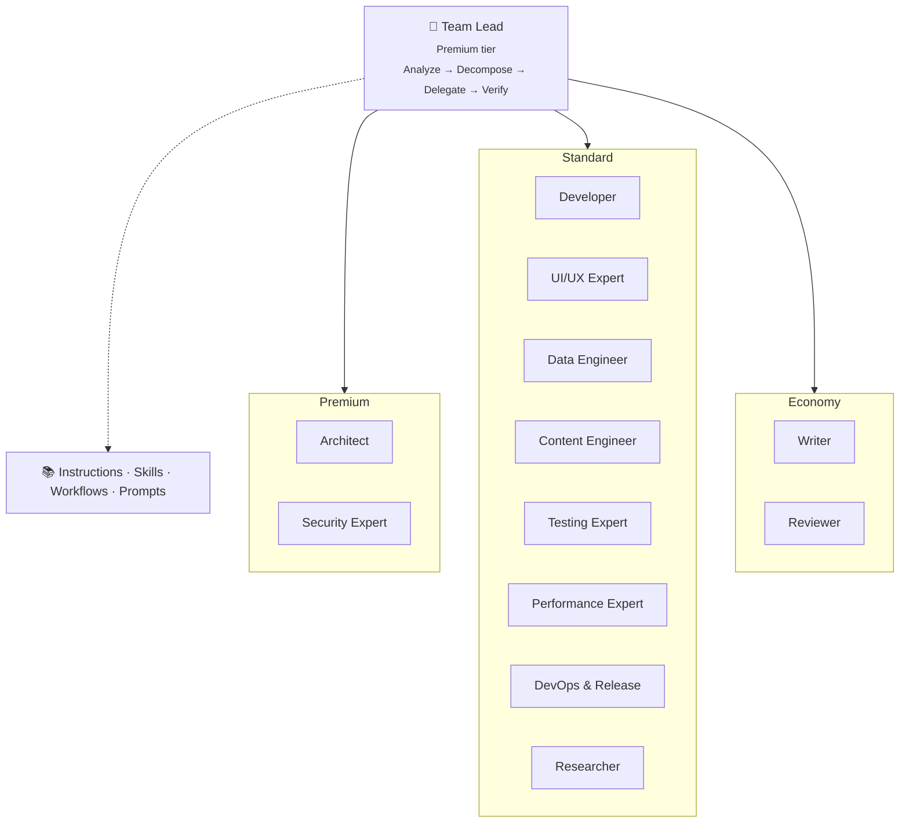
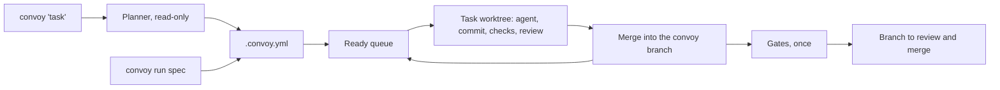

# Architecture

> Back to [README](README.md)

OpenCastle compiles one definition of your project's AI assistant setup —
instructions, agents, skills, MCP servers — into the native format of every
assistant your team uses, and reports when the generated files drift from source.

An experimental convoy engine builds on the same content to run long multi-step
work in dependency order. The compiler does not depend on it.

---

## System Overview


```mermaid
graph TB
    TL["🏰 Team Lead<br/><sub>Premium tier</sub><br/><sub>Analyze → Decompose → Delegate → Verify</sub>"]

    subgraph Premium["Premium"]
        ARCH[Architect]
        SEC[Security Expert]
    end

    subgraph Standard["Standard"]
        DEV[Developer]
        UI[UI/UX Expert]
        DATA[Data Engineer]
        CE[Content Engineer]
        TEST[Testing Expert]
        PERF[Performance Expert]
        OPS[DevOps &amp; Release]
        RES[Researcher]
    end

    subgraph Economy["Economy"]
        WRITE[Writer]
        REV[Reviewer]
    end

    TL --> Premium
    TL --> Standard
    TL --> Economy

    KB["📚 Instructions · Skills · Workflows · Prompts"]
    TL -.-> KB
```

---

## Capability Tiers

Agents declare a tier rather than a model. Which model serves a tier is the
assistant's decision — it knows which models the account can reach, what they
cost today, and which have been retired.

| Tier | For |
|------|-----|
| Premium | Orchestration, architecture, security review — the hardest reasoning |
| Standard | Feature work, schemas, UI, tests — the bulk of the work |
| Economy | Review passes, docs, copy — high volume, low ambiguity |

Defined once in [`src/cli/tiers.ts`](src/cli/tiers.ts); agent frontmatter carries
`tier:` and a test asserts no shipped file names a model.

---

## Execution Modes

The Team Lead takes one of three paths, depending on the task:

| Mode | When | Mechanism | Parallelism |
|------|------|-----------|-------------|
| **Compact** | Score ≤2, single subtask | Direct sub-agent delegation | Sequential |
| **Convoy** | Score 3+ or multi-task | `.convoy.yml` spec → ConvoyEngine | Parallel (DAG-based) |
| **Utility** | `create-skill`, `brainstorm`, `quick-refinement` | Direct delegation, no convoy | Sequential |

**Compact mode** handles small, focused tasks synchronously within a single conversation. The Team Lead delegates to one specialist at a time, reviews the output, and moves on.

**Convoy mode** runs complex, multi-step work through the experimental convoy engine. See [Convoy Architecture](#convoy-architecture) below.

---

## Agents

13 specialist agents, each with a defined scope, output contract, and file partition boundary.

| Agent | Domain |
|-------|--------|
| Team Lead | Orchestration — never writes code |
| Architect | Strategic architecture decisions, ADRs, system design |
| Security Expert | Auth, authorization, access policies, security headers, input validation |
| Developer | Pages, components, routing, API routes and their contracts, server logic |
| UI/UX Expert | Accessible, consistent UI components and design system |
| Data Engineer | Migrations, access policies, query performance, ETL pipelines, imports |
| Content Engineer | CMS schemas, content types, queries |
| Testing Expert | E2E tests, integration tests, browser validation |
| Performance Expert | Frontend, backend, and build performance |
| DevOps & Release | Deployments, CI/CD, cron jobs, pre-release verification, changelogs |
| Researcher | Deep codebase exploration, pattern discovery, git archaeology |
| Writer | UI copy, error messages, docs, roadmaps, meta tags, structured data |
| Reviewer | Fast validation after every delegation |

---

## Knowledge System

```
src/orchestrator/
├── agents/          # Agent definitions (.agent.md)
├── skills/          # Reusable domain expertise
├── instructions/    # Cross-cutting guidelines
├── agent-workflows/ # Multi-step workflow templates
├── prompts/         # Prompt templates
├── plugins/         # Integrations — each an Agent Plugin (plugin.json, skills/, mcp.json) declared in config.ts
└── customizations/  # Templates scaffolded into a project's .opencastle/
```

**Skills** are on-demand knowledge modules loaded by agents when entering a specific domain. Examples: `react-development`, `security-hardening`, `testing-workflow`, `observability-logging`.

**Always loaded** are the instructions: OpenCastle's two (`general`, `ai-optimization`),
the team's own (`.opencastle/instructions/`), and the project's facts —
`.opencastle/project.instructions.md`, which `init` writes from the code — compiled as
the `project-context` instruction ([`layers.ts`](src/cli/layers.ts)), without its
comments, empty rows and sections, or its "Still to describe" list. An agent told in
words to read a file reads it when it decides to; the commands, stack and structure
are what every assistant's guidance says belongs in the always-loaded file.


---

## Adapters

One adapter per assistant ([`src/cli/adapters/`](src/cli/adapters/)) compiles
instructions, agents, skills, commands and MCP config into that assistant's
format. Which paths each one writes is in the README's
[Supported assistants](README.md#supported-assistants) table.

| Adapter | Assistant |
|---------|-----------|
| `vscode` | VS Code (GitHub Copilot) |
| `cursor` | Cursor |
| `claude-code` | Claude Code |
| `opencode` | OpenCode |
| `windsurf` | Windsurf (Devin Desktop) |
| `codex` | Codex CLI |
| `antigravity` | Antigravity |

Assistants that read one root file — `CLAUDE.md`, `AGENTS.md`, `GEMINI.md` — get the
instructions in a managed block there, followed by an index of the agents and skills.
Claude Code is the exception: it lists its subagents and skills itself, from
`.claude/agents/` and `.claude/skills/`, so `CLAUDE.md` says where they are instead of
repeating them — about 3k tokens a session would otherwise load twice, and again in every
subagent.

An assistant that also reads another target's root file does not get the
instructions twice. Antigravity reads `AGENTS.md` beside `GEMINI.md`, and Cursor
applies `CLAUDE.md` and `AGENTS.md` to every conversation, so with a target that
writes one of those selected, `GEMINI.md` points to it and Cursor writes no
instruction rules of its own (`alsoReads` in
[`single-file-base.ts`](src/cli/adapters/single-file-base.ts) and
[`rules-dir-base.ts`](src/cli/adapters/rules-dir-base.ts)).

---

## Team Sources

The adapters compile one directory. It is the merge of three kinds of layer,
resolved in [`layers.ts`](src/cli/layers.ts):

```
OpenCastle's own content   src/orchestrator/ and the skills of included plugins
  → baselines              npm packages or relative paths named in "extends"
    → the project          .opencastle/
```

A layer is a directory laid out like `.opencastle/`: `config.json` (schema at
[`website/public/schema/config.json`](website/public/schema/config.json)),
`instructions/*.md` (always loaded), `agents/*.agent.md`,
`skills/<name>/SKILL.md`, `prompts/*.md` and `workflows/*.md`. Items are keyed
`kind/name`. A later layer's item replaces an earlier one with the same key,
and `exclude` drops one from below — content, or an MCP server as
`mcpServers/<name>`. A baseline's own `extends` load beneath
it; a baseline reached twice loads once, at the lowest place it appears; a
cycle is an error.

- **Resolution.** A package in `extends` is found the way Node finds one —
  `node_modules` from the declaring layer upwards — so npm, pnpm, Yarn and
  workspaces all work, and the version is whatever the project's lockfile
  pinned. OpenCastle fetches nothing itself. A package is a baseline when its
  `package.json` declares `"opencastle": { "baseline": "<dir>" }`, or when it
  is an Agent Plugin (a `plugin.json` at its root); then the layer is its
  `dev.opencastle/` directory plus the portable `skills/` and `mcp.json`. A
  relative path resolves from the directory of the `config.json` that names it
  — `.opencastle/` for the project. A version in `extends` (`pkg@1.2.3`) and an absolute path
  are refused.
- **Materialized source.** `materialize()` writes the merged items to a scratch
  directory shaped like `src/orchestrator/`, normalising team files on the way:
  LF line endings (so a digest is the same on every checkout), `applyTo: '**'`
  on any instruction that does not set one (so Copilot loads it too), a `name`
  on an agent without frontmatter. OS files (`.DS_Store`, `Thumbs.db`) are
  skipped; a link to somewhere outside both the layer and the project is not
  followed, with a warning. Every adapter
  compiles from that directory, so all seven targets receive team content with
  no per-target code, and `sync`, `sync --check`, `review` and `explain` read
  one resolution.
- **Policy** ([`policy.ts`](src/cli/policy.ts)) only tightens on the way up. A
  server must be on every layer's `mcp.allow`, and a remote one must connect to
  a host on every `mcp.remoteHosts`; `requirePinned`, once on, stays on;
  `require` accumulates; the smallest `contextBudget` wins; every `opencastle`
  version range must hold.
  A team server refused by its own layer's policy or one below it, an unpinned
  server under `requirePinned`, a credential written inline, a required item
  excluded — or replaced above the layer that requires it — an unsatisfied
  version range or a baseline that is not installed is an error: `sync` writes
  nothing and `sync --check` fails. A server a *higher* layer's policy refuses
  is left out instead, as is an integration server the policy refuses: that is
  how a repository opts out of a baseline's server. The lock records why.
- **Team MCP servers** are written in each target's variable syntax
  ([`mcp.ts`](src/cli/mcp.ts)): `${NAME}` for Claude Code, `${env:NAME}` for
  Cursor and Windsurf, `{env:NAME}` for OpenCode. VS Code forwards a plain
  `env` variable through `envFile` and turns any other reference into a
  password input. Codex expands no variables, so `.codex/config.toml` gets the
  field that reads one instead: a forwarded variable in `env_vars`, a
  `Bearer ${NAME}` header as `bearer_token_env_var`, a header that is only
  `${NAME}` in `env_http_headers`. Antigravity expands no variables and has no
  field that reads one, so an `env` entry that only forwards a variable is left
  out — the server inherits it — and any other reference is left as written for
  `doctor` to name; its remote servers are written with `serverUrl`. Editor variables are not environment variables: VS Code and
  Cursor get `${workspaceFolder}` as written, the others `.` (they start a
  project's servers in the project directory) and `HOME` for `${userHome}`. A
  server an earlier sync wrote that no layer defines any more is removed, with
  any VS Code input OpenCastle wrote for it that no remaining server uses; the
  committed lock names which those are, so `sync` holds the lock back while an
  MCP config cannot be read.
- **The lock** ([`lock.ts`](src/cli/lock.ts)). `.opencastle/lock.json` records
  the layers with their versions and a digest of each baseline's content; every
  item with the layer it came from, a content hash and, for instructions, a
  token estimate; every MCP server with how it launches, which variables it
  reads and, for a team server, a digest of its whole definition (so a literal
  environment value or header moves the lock); what was excluded or blocked;
  each layer's policy; and the
  always-loaded context. No timestamps, no absolute paths, keys in a fixed
  order, so it changes only when what the assistants get changes. `sync` writes
  it, `sync --check` compares it like any generated file, `review` diffs it
  between two commits, and `fleet` reads it across repositories.
- **Health** ([`team-health.ts`](src/cli/team-health.ts)). `doctor` reports
  whether the team sources resolve; the always-loaded context — instructions
  plus the skill and agent index, estimated at four characters per token —
  against the budget, naming the largest contributors when it is over; `npm run`
  scripts named in team content, and backticked paths named in the project's
  own content, that no longer exist; and a CLI older than the release that
  compiled the project, which `sync` refuses to downgrade without
  `--allow-downgrade` and `sync --check` reports instead of comparing.

---

## Workflow Templates

| Template | Flow |
|----------|------|
| `feature-implementation` | DB → Query → UI → Tests |
| `bug-fix` | Triage → RCA → Fix → Verify |
| `data-pipeline` | Scrape → Convert → Enrich → Import |
| `security-audit` | Scope → Automate → Review → Remediate |
| `performance-optimization` | Measure → Analyze → Optimize → Verify |
| `schema-changes` | CMS model modifications and queries |
| `database-migration` | Migrations, access policies, rollback |
| `refactoring` | Safe refactoring with behavior preservation |

Each template ends with the shared delivery phase
([`shared-delivery-phase.md`](src/orchestrator/agent-workflows/shared-delivery-phase.md)):
commit, push, open a pull request, never merge. It is written once and compiled
into every template (`src/cli/adapters/workflows.ts`), so a template is whole
wherever an assistant reads it; the phase is never installed on its own.

---

## Quality Gates

| Gate | Method |
|------|--------|
| **Deterministic** | Lint, type-check, unit tests, build verification |
| **Fast review** | Mandatory single-reviewer sub-agent after every delegation, with automatic retry and escalation |
| **Panel review** | 3 isolated reviewer sub-agents, 2/3 majority wins (high-stakes or escalation) |
| **Structured disputes** | Formal dispute records when automated resolution is exhausted — packages both perspectives for human decision |
| **Browser testing** | Chrome DevTools MCP at project-defined responsive breakpoints |
| **Secret scan** | Post-execution scan for leaked credentials (API keys, tokens, passwords) |
| **Blast radius** | Detects risky file patterns (migrations, auth changes, RLS policies) |

These are the gates the Team Lead follows in a session (the `validation-gates`
skill). The convoy engine runs its own; see [Gates](#gates).

---

## Convoy Architecture

A **convoy** runs multi-step work with several agents at once. It plans the
work, runs each task in a git worktree of its own, reviews and merges each
result onto one branch, and runs the project's checks once at the end. It is
experimental. Its commands and flags are on the
[CLI page](https://www.opencastle.dev/docs/cli#convoy), and real runs are on
[Use cases](https://www.opencastle.dev/docs/use-cases).


```mermaid
graph LR
    T["convoy 'task'"] --> P["Planner, read-only"]
    P --> S[".convoy.yml"]
    R["convoy run spec"] --> S
    S --> Q["Ready queue"]
    Q --> W["Task worktree: agent, commit, checks, review"]
    W --> M["Merge into the convoy branch"]
    M --> Q
    M --> G["Gates, once"]
    G --> B["Branch to review and merge"]
```

### Planner

`opencastle convoy "<task>"` and `convoy plan --prd <file>`
([`pipeline.ts`](src/cli/pipeline.ts)) turn a request into a spec. Every
planning session is read-only and runs on the run's runtime. Where the runtime
maps tiers to models, the writing steps run on the standard tier's model and the
checking steps on the economy tier's ([`plan.ts`](src/cli/plan.ts)). The prompts
are the seven pipeline templates in
[`src/orchestrator/prompts/`](src/orchestrator/prompts/).

Planning was the slowest part of a run, and most of a planning session was the
model thinking, not reading code. Three things keep it short:

- **Effort.** The plan is written at `medium` reasoning effort and every other
  step at `low`, where the runtime takes one (Claude Code and Copilot
  `--effort`, Codex `model_reasoning_effort`). Measured on Claude Code, a PRD
  took 129s at the default and 36s at `low`, with every section.
- **Lean sessions.** On Claude Code a planning session starts no MCP server,
  loads no skill or command, and has only `Read`, `Grep` and `Glob`. That
  halved its cost, and it cannot spend time on a web search or a sub-agent.
  Each flag is passed only when the installed version lists it in `--help`.
- **Steps that do not wait for each other start together**, and the answer
  that decides stops the one not needed. The steps are below.

1. **Sizing.** `assess-complexity` sizes the request on the economy model. At
   the same time a plan is written straight from the request, and a PRD is
   written. A change sized `low`, with no split into groups, keeps that plan and
   stops the PRD: no PRD (two sessions to wait for, three with `--yes`).
   Otherwise the plan from the request is stopped and the PRD kept.
2. **PRD, for larger work.** `generate-prd` writes `.opencastle/prds/<name>.prd.md`,
   and `validate-prd` reviews it. When how to plan it is already known, the
   plan is written from the PRD while it is reviewed; a PRD that fails review
   stops that plan, gets up to two `fix-prd` rounds, and is planned again from
   the fixed text. The request's sizing is reused, unless it recommended
   groups: then the PRD is sized again, beside its review, so the groups can
   name its phases. `convoy plan --prd <file>` starts here, with a PRD you
   edited, and sizes it beside its review; that sizing is cached beside the PRD
   and reused only for the same text.
3. **The plan.** `generate-convoy` answers with a JSON task plan. When the
   sizing splits a large PRD into groups, each group is planned at the same time
   and the plans are joined into one spec. An unreadable answer is asked for
   once more.
4. **Code checks** ([`spec-builder.ts`](src/cli/convoy/spec-builder.ts)). A glob
   in `files` becomes the directory before its first wildcard. A task whose
   files are all tests, and which waits on exactly one other task (once
   dependencies implied by others are dropped), is folded into that task, so
   the agent that writes the code writes its tests. Then the spec is validated
   (ids, dependencies, cycles), paths must be relative, and no two tasks that
   can run at once may claim the same file.
5. **Fixes only when a check fails.** Up to two `fix-convoy` rounds. Overlaps
   still left are sequenced: the later task waits for the earlier.

With `--yes` nobody reads the plan, so `validate-convoy` reviews it once, and
one `fix-convoy` round applies its issues if the result still passes the
checks. The plan is printed as a table, with what planning spent, before
`Run it? [Y/n]`. A closed stdin is a no.

### Spec defaults

The planner decides the tasks, their prompts, agents, files and dependencies.
The code sets everything about how the run behaves:

| Field | Planned spec | Hand-written spec, when left out |
|-------|--------------|----------------------------------|
| `branch` | `convoy/<slug>`, the spec file's name | `convoy/<name>-<6 hex>` |
| `concurrency` | the plan's widest dependency level, at most 4 | 4 |
| `on_failure` | `continue` | `continue` |
| `adapter` | the runtime that planned it | resolved at run time (below) |
| `gates` | the project's `typecheck`, `lint`, `test` and `build` scripts, with its package manager | none |
| `gate_retries` | 1 when there are gates | 0 |
| `defaults` | `timeout: 30m`, `max_retries: 1`, `review: fast` | `timeout: 30m`, `max_retries: 1`, review `auto` |

A planned task with a `complexity` score takes its timeout, retries and review
level from the effort table in
[`effort-scaling.ts`](src/cli/convoy/effort-scaling.ts): 1–2 is 5–10 minutes, one
retry and `review: auto`; 3–8 is 15–30 minutes, two retries and `review: fast`;
13 is 45 minutes, three retries and `review: panel`.

`on_failure: continue` means a failed task blocks only what depends on it;
`stop` starts no new task after the first failure. The package manager comes
from `packageManager` in `package.json`, else the lockfile. A `test` script
that `npm init` wrote, or one that watches, is not used as a gate. A spec
without `version` is version 1; a version 2 spec (a chain of specs) is refused
with what to do instead ([`schema.ts`](src/cli/run/schema.ts)).

### Scheduler

[`engine.ts`](src/cli/convoy/engine.ts) runs a ready queue. A task is ready when
every task it depends on is done. Ready tasks start as slots free up, up to
`concurrency`, the task that most others wait on first and ties in spec order.
A ready task does not start beside a running task whose `files` overlap its own
([`schedule.ts`](src/cli/convoy/schedule.ts)).

A failed attempt goes back to the queue while it has retries left, with the
reason told to the next attempt: the exit and the end of its output, the gate
that failed, or the reviewer's issues. A task out of retries fails, its
dependents are skipped, and its record goes to `.opencastle/AGENT-FAILURES.md`.

The agent for a task runs on the spec's `model` when it names one, otherwise on
the runtime's model for the agent's capability tier. Claude Code maps premium,
standard and economy to its `opus`, `sonnet` and `haiku` aliases; the other
runtimes have no mapping and use their own default model. Every task's prompt
starts with the same shared context — the whole plan and the rules every worker
follows, among them to leave `.opencastle/` to the convoy even where the
project's instructions ask for an edit there — and ends with the task's own part: its role, its files, what the tasks
before it produced, and any note from a failed attempt. Runtimes with a prompt
cache can reuse the shared part ([`isolation.ts`](src/cli/convoy/isolation.ts)).

A worker reports a lesson or a bug outside its task on a line of its own,
`[LESSON <category>] <what to do> — <why>` or `[ISSUE] <where>: <what>`. When
the run ends, the engine reads them back from each finished task's stored
answer, so a resumed run has them all. Each lesson becomes a file in
`.opencastle/lessons/`, committed on the run's branch with the index, and is
reviewed and merged with the work; one the project already has is skipped, and
one that looks like it holds a credential is dropped. Issues are printed in the
run's summary ([`findings.ts`](src/cli/convoy/findings.ts)).

### Worktrees and merging

Every worktree lives directly under `.opencastle/worktrees/`, with a short name,
to stay under Windows' path limit ([`worktree.ts`](src/cli/convoy/worktree.ts)):

- **The integration worktree** checks out the run's branch, created from the
  current branch when it does not exist yet. Merges happen here, never in your
  checkout, and a spec naming the branch you have checked out is refused.
- **A task worktree** is cut from the tip of the run's branch on a worker branch
  of its own. When the agent finishes, its work is committed there
  (`--no-verify`) before any check or review reads the change.

Commands that add, remove or list worktrees, and branch deletions, queue per
repository: a `git worktree add` reads every other worktree's entry, and one
still being written by a concurrent add fails it. A git refusal over a lock is
retried with backoff.

The merge queue ([`merge.ts`](src/cli/convoy/merge.ts)) merges one worker branch
at a time into the integration worktree. A conflict re-runs the task once, from
the current tip, told which files moved under it. A second conflict, or any
other merge error, fails the task and keeps its worker branch, which the summary
names. The integration worktree is removed when the run ends; the branch is the
result.

### Gates

Two kinds of check, both run through the platform's own shell
([`platform.ts`](src/cli/run/platform.ts)):

- **Project gates.** The spec's `gates` run once, after every task has merged,
  on the integration worktree. With `gate_retries`, failing gates get that many
  fix attempts by one agent working on the merged result. A task may list its
  own `gates`, which run in its worktree before review.
- **Built-in gates** ([`gates.ts`](src/cli/convoy/gates.ts)). `no_op` is on unless
  the spec turns it off: a task that declared `files` and changed nothing fails,
  because a clean exit is not proof the work happened. The others run only when
  `defaults.built_in_gates` turns them on: `secret_scan`, `blast_radius`,
  `browser_test` and `tdd_check` per task, and `regression_test` and
  `dependency_audit` once at the end.

Changes outside a task's `files`, and an answer without its role's output
summary, are recorded as warnings; the work is kept.

### Reviewer

[`reviewer.ts`](src/cli/convoy/reviewer.ts) reviews a task's committed change
before it merges.

- `review: auto` passes a `writer`'s change, and a change of at most 10 lines in
  at most 2 files, without a reviewer. Paths under `auth/`, `security/`,
  `migrations/` or `rls/`, and the `security-expert` and `data-engineer` agents,
  always get one.
- `review: fast` (and anything `auto` does not pass) gets one review: a
  read-only session of the task's runtime, in the task's worktree, given the
  task and the diff, on the spec's `reviewer_model` or the runtime's economy
  model. It ends with a `pass` or `block` verdict.
- `review: panel` asks three reviewers; two blocks block. A third blocked panel
  opens a dispute in `.opencastle/DISPUTES.md`.
- `review: none` skips review.

A `block` sends the task back with the reviewer's issues as a failed attempt. A
review that cannot run, times out or gives no verdict is recorded as skipped,
never as a pass. Reviews run at most `max_concurrent_reviews` (3) at once, and
`review_budget` caps the tokens they may spend.

### Store and events

[`store.ts`](src/cli/convoy/store.ts) keeps runs, tasks, workers and events in
SQLite (`.opencastle/convoy.db`, WAL mode, `node:sqlite`). A lock row with a
10-second heartbeat lets one engine at a time write to the database; one left by
a process that has died on this machine is taken over at once
([`lock.ts`](src/cli/convoy/lock.ts)).

Every event is written twice ([`events.ts`](src/cli/convoy/events.ts)): to SQLite,
and to `.opencastle/logs/convoys/<convoy-id>.ndjson`, fsynced per event.
Secrets are masked before either copy is written, and in task output, failure
records and disputes ([`redact.ts`](src/cli/convoy/redact.ts)).
[TELEMETRY.md](src/cli/convoy/TELEMETRY.md) lists every event type and its data.

Tokens and cost are what the runtime reports. Where it reports none, tokens are
estimated from the text and cost from the model it names, and both are marked
as estimates ([`pricing.ts`](src/cli/convoy/pricing.ts)).

### Read model and dashboard

[`read-model.ts`](src/cli/convoy/read-model.ts) is the one read path into a
project's runs. It opens the database read-only, selects only the columns the
database has, and never migrates it. A run is live while its status is pending
or running and the lock's heartbeat is under a minute old; one recorded as
running with no live process is shown as `interrupted`. Bare
`opencastle convoy` and `convoy resume` read through it, and so does the
dashboard.

Besides runs, tasks and events, it counts what the dashboard shows across runs
and within one: runs by status, success rate, average and p95 duration, token
and cost totals (flagged when any part is an estimate), runs per day, tasks by
agent and model, tiers from `delegation` events, attempts by mechanism from
`task_started`, every review verdict and skipped review, every gate result with
the attempt or round it checked, retries, the dead-letter queue and artifacts.
Every figure is counted from rows the engine wrote; one the database does not
hold is returned as null, which the page shows as "not reported", never as 0.
The overview is built from per-project parts, so several projects combine into
one by their rows (the website's demo does this).

The Observability dashboard is four files in
[`src/cli/dashboard/`](src/cli/dashboard/) (the HTML, its stylesheet and
script, and an icon), with no build step, served by
[`dashboard.ts`](src/cli/dashboard.ts) on 127.0.0.1 with four JSON endpoints:
the runs with the overview, one run with its tasks and what its events and side
tables add, a run's events after a cursor, and the agent sessions — the
`opencastle log` records and the engine's own `session` events, each labelled.
It answers only GET and HEAD, only for a local Host header, and serves no file
but its own four. The page refreshes the run list every 10 seconds and a live
run every 2, reading only the events after its cursor. A run started on a
terminal outside CI starts the dashboard on port 4300, or the next free port,
and prints its address.

[`tools/dashboard-demo/export.mjs`](tools/dashboard-demo/export.mjs) writes the
same API responses from one or more projects' runs as data files, and
[`assemble.mjs`](tools/dashboard-demo/assemble.mjs) puts the page beside them in
its static mode; the website's deploy does that over a committed snapshot and
publishes it at [opencastle.dev/dashboard](https://www.opencastle.dev/dashboard/).

### Adapters and platform

Workers run on one of five runtimes ([`src/cli/run/adapters/`](src/cli/run/adapters/)):

| Adapter | Command | Assistant `init` configured |
|---------|---------|-----------------------------|
| `claude` | `claude -p` | Claude Code |
| `copilot` | `copilot` | VS Code (GitHub Copilot) |
| `cursor` | `cursor-agent -p` (or Cursor's `agent`) | Cursor |
| `opencode` | `opencode run` | OpenCode |
| `codex` | `codex exec` | Codex CLI |

Windsurf and Antigravity have no command-line agent, so they are compile targets
only. `resolveAdapter` picks the runtime: `--adapter`, then the spec's `adapter`,
then the assistants in `.opencastle/manifest.json` in order, then the first of
`claude`, `codex`, `cursor`, `opencode` and `copilot` found on PATH. A runtime
named by flag or spec that is not installed is an error, never a switch to
another. A task's own `adapter:` overrides the run's.

Each adapter sends the prompt on stdin and records the usage, cost and model the
runtime reports. Permission modes are Claude Code's names, translated for each
CLI in [`permission-modes.ts`](src/cli/run/adapters/permission-modes.ts): workers
run with edits accepted (`acceptEdits`), planning and review read-only. Claude
Code's read-only is its default mode with `Edit`, `Write` and `NotebookEdit`
disallowed, because its plan mode changes the model. `defaults.permission_mode`
in a spec sets the workers' mode; every adapter accepts every mode.

[`platform.ts`](src/cli/run/platform.ts) keeps this the same on macOS, Linux and
Windows: commands are found on PATH without `which`, honouring `PATHEXT`; npm's
`.cmd` shims are spawned through the shell; gates run in the platform shell; and
a stop takes the whole process tree, SIGTERM then SIGKILL after 5 seconds, or
`taskkill /T /F` on Windows.

### Interrupt and resume

The first Ctrl+C (or SIGTERM) stops every agent session, starts no new task and
stops running gates and hooks, which sit in a process group of their own. Running
tasks go back to pending, the run is marked `interrupted`, and the command prints
`Resume with: opencastle convoy resume` and exits 130. Tasks get 10 seconds to
wind down; a second Ctrl+C exits at once.

`convoy resume` continues the newest run that is not done, with the spec and
runtime recorded when it started. Every task not done goes back to pending:
failed, timed out, interrupted, or skipped because of a failure. Failed tasks
get their retries back, interrupted ones keep theirs, and finished tasks are
kept. It reuses or
prunes the integration worktree a killed run left, removes stale task
worktrees, and copies events missing from the NDJSON log back from SQLite.
`convoy resume --dry-run` lists what would run.

### Spec options the planner does not write

A hand-written spec can also use these, all off by default:
`defaults.circuit_breaker` (an agent that fails too often gets no new tasks for a
cooldown; its tasks run as the `fallback_agent` when one is named), per-task `steps` (prompts run in order in one worktree, each with
`gates` and an `if`), `hooks` (`pre_task`, `post_task`, `post_convoy`), `outputs`
and `inputs` (text one task produces for another), `persistent: true` (an agent
remembers its last tasks), and per-task `adapter` and `model`.

---


## MCP Servers

Each plugin that brings an MCP server declares it once
([`src/orchestrator/plugins/*/config.ts`](src/orchestrator/plugins/)), and every
adapter writes it in that target's dialect — `servers` for VS Code,
`[mcp_servers.<name>]` TOML tables for Codex, OpenCode's `mcp` with
`local`/`remote` entries, and `mcpServers` for the rest (Antigravity's remote
servers as `serverUrl`).

An MCP server is code an agent runs with the developer's credentials, so the
defaults are held to the rules a supply-chain review would apply:

- **Pinned or owned.** A server launched through a package runner is pinned to
  an exact version, or runs the project's own dependency with `npx --no` (Prisma,
  Convex, Nx — the version the project's lockfile pins), or is the vendor's own
  remote server. [`pins.test.ts`](src/orchestrator/plugins/pins.test.ts) enforces
  it. `npm run mcp:check` confirms every pin still exists on the registry and runs
  weekly in CI; `npm run mcp:bump` moves pins to the latest release.
- **Moved forward, never overwritten.** A rebuild leaves existing entries alone,
  because people tune them. Plugins record the defaults earlier releases wrote
  (`previousMcpConfigs`); an entry still byte for byte one of those is replaced on
  `sync` and named in its output. An edited entry stays the user's.
- **Audited.** `doctor` and the status command read every target's MCP config,
  including servers the user added ([`mcp-audit.ts`](src/cli/mcp-audit.ts)): an
  unpinned package warns (fails, when the team's policy sets `requirePinned`); a
  package OpenCastle knows is not on npm, a remote server Claude Code would read
  as stdio, a credential written into the file, or a server the team's policy
  does not allow, fails. Each finding carries the remedy that works for it —
  `sync` only for entries it still owns. What it cannot read (a container
  image, a runner option it does not know) it reports as not audited rather than
  passing.
- **Checked in CI.** `sync --check` runs the same audit, so it cannot pass what
  `doctor` fails: whatever `sync` would change in an MCP config — an entry it
  moves forward, a plugin server the stack dropped — is `outdated` drift, and a
  failure only a person can clear is `unreducible`. The latter fails CI but does
  not make `sync` recompile or the status line call the output stale.

---

## Observability

Convoy runs log themselves: every event goes to `.opencastle/convoy.db` and
`.opencastle/logs/convoys/<convoy-id>.ndjson`, with a `session` event per task
it finishes ([TELEMETRY.md](src/cli/convoy/TELEMETRY.md)). The Observability
dashboard shows them; see [Read model and dashboard](#read-model-and-dashboard).
Work outside a convoy is not logged: agents were once told to log every session
by hand, and the record never came out consistent enough to rely on.

---

## CLI

| Command | Purpose |
|---------|---------|
| *(none)* | Project status: targets, drift, and the next command to run |
| `init` | Set up the project from detected stack and existing assistant config |
| `sync` | Recompile every configured target from source |
| `add <pack>` | Adopt an integration and recompile |
| `doctor` | Diagnose configuration problems |
| `remove` | Remove OpenCastle, keeping or deleting generated files |
| `explain` | What every assistant here is given, where each piece comes from, and what you still need to set up |
| `review` | What a change does to the assistants, compared with the lock at a base ref |
| `ci` | Write a GitHub Actions workflow running `sync --check` and `review`, and optionally CODEOWNERS lines |
| `baseline` | Scaffold (`init`) or validate (`check`) a baseline package — one that `init` creates is also an Agent Plugin |
| `plugin` | Check an Agent Plugin, build Claude Code's files from it (`build`), write marketplace files for a directory of them (`index`) |
| `promote` | Copy a personal skill into the team's sources or a baseline (`skill`), or Claude Code's auto memory for this repository into lessons (`memory`) |
| `fleet` | OpenCastle and baseline versions, and MCP server spread, across many repositories' locks |
| `convoy` | Experimental: plan multi-step work and run it with agents in parallel |

On GitHub Actions, `sync --check` also writes an `::error` annotation on each
drifted file and a table to `$GITHUB_STEP_SUMMARY`
([`github-report.ts`](src/cli/github-report.ts)), and `review` appends its
Markdown to the same summary; elsewhere their output is unchanged.

`log` and `lesson` also exist but are invoked by agents from generated
instructions rather than by people, so they are not listed in help.
