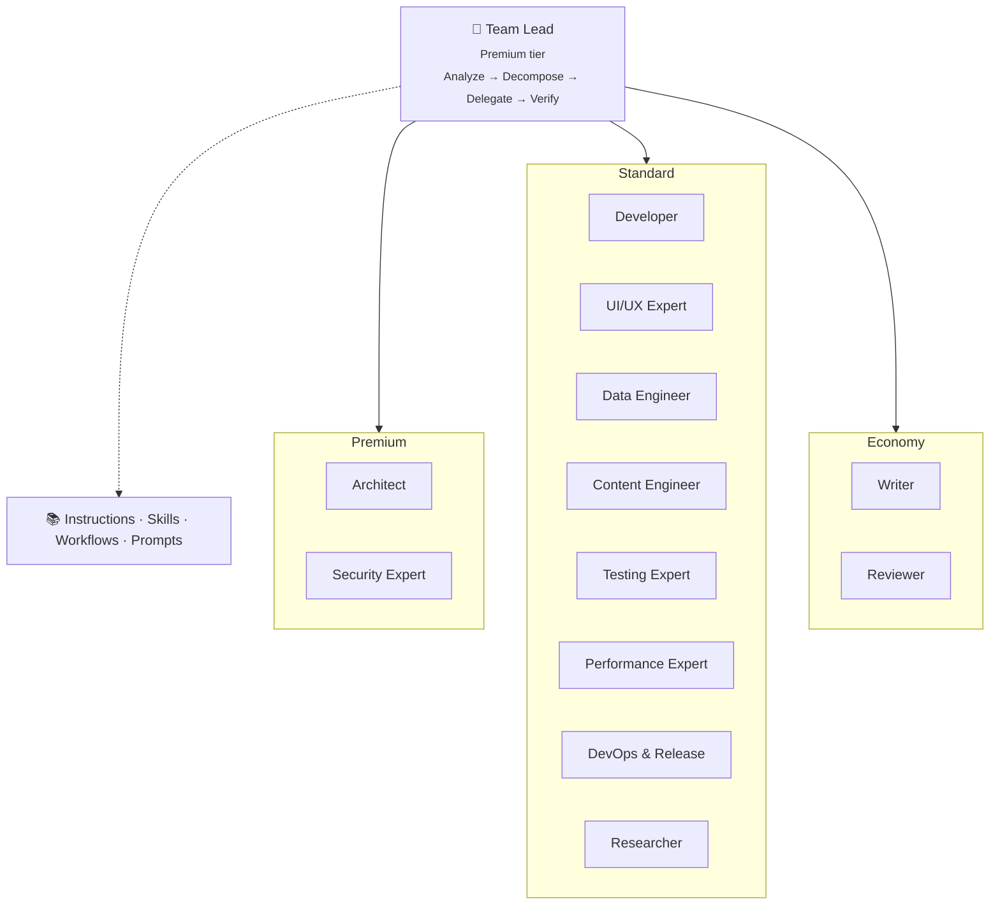
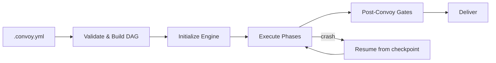

# Architecture

> Back to [README](README.md)

OpenCastle compiles one definition of your project's AI assistant setup —
instructions, agents, skills, MCP servers — into the native format of every
assistant your team uses, and reports when the generated files drift from source.

An experimental convoy engine builds on the same content to run long multi-step
work in dependency order. The compiler does not depend on it.

---

## System Overview


```mermaid
graph TB
    TL["🏰 Team Lead<br/><sub>Premium tier</sub><br/><sub>Analyze → Decompose → Delegate → Verify</sub>"]

    subgraph Premium["Premium"]
        ARCH[Architect]
        SEC[Security Expert]
    end

    subgraph Standard["Standard"]
        DEV[Developer]
        UI[UI/UX Expert]
        DATA[Data Engineer]
        CE[Content Engineer]
        TEST[Testing Expert]
        PERF[Performance Expert]
        OPS[DevOps &amp; Release]
        RES[Researcher]
    end

    subgraph Economy["Economy"]
        WRITE[Writer]
        REV[Reviewer]
    end

    TL --> Premium
    TL --> Standard
    TL --> Economy

    KB["📚 Instructions · Skills · Workflows · Prompts"]
    TL -.-> KB
```

---

## Capability Tiers

Agents declare a tier rather than a model. Which model serves a tier is the
assistant's decision — it knows which models the account can reach, what they
cost today, and which have been retired.

| Tier | For |
|------|-----|
| Premium | Orchestration, architecture, security review — the hardest reasoning |
| Standard | Feature work, schemas, UI, tests — the bulk of the work |
| Economy | Review passes, docs, copy — high volume, low ambiguity |

Defined once in [`src/cli/tiers.ts`](src/cli/tiers.ts); agent frontmatter carries
`tier:` and a test asserts no shipped file names a model.

---

## Execution Modes

The Team Lead operates in two modes depending on task complexity:

| Mode | When | Mechanism | Parallelism |
|------|------|-----------|-------------|
| **Compact** | Score ≤2, single subtask | Inline `runSubagent` calls | Sequential |
| **Convoy** | Score 3+ or multi-task | `.convoy.yml` spec → ConvoyEngine | Parallel (DAG-based) |

**Compact mode** handles small, focused tasks synchronously within a single conversation. The Team Lead delegates to one specialist at a time, reviews the output, and moves on.

**Convoy mode** is the structured execution engine for complex, multi-step work. See [Convoy Architecture](#convoy-architecture) below.

---

## Agents

13 specialist agents, each with a defined scope, output contract, and file partition boundary.

| Agent | Domain |
|-------|--------|
| Team Lead | Orchestration — never writes code |
| Architect | Strategic architecture decisions, ADRs, system design |
| Security Expert | Auth, authorization, access policies, security headers, input validation |
| Developer | Pages, components, routing, API routes and their contracts, server logic |
| UI/UX Expert | Accessible, consistent UI components and design system |
| Data Engineer | Migrations, access policies, query performance, ETL pipelines, imports |
| Content Engineer | CMS schemas, content types, queries |
| Testing Expert | E2E tests, integration tests, browser validation |
| Performance Expert | Frontend, backend, and build performance |
| DevOps & Release | Deployments, CI/CD, cron jobs, pre-release verification, changelogs |
| Researcher | Deep codebase exploration, pattern discovery, git archaeology |
| Writer | UI copy, error messages, docs, roadmaps, meta tags, structured data |
| Reviewer | Fast validation after every delegation |

---

## Knowledge System

```
src/orchestrator/
├── agents/          # Agent definitions (.agent.md)
├── skills/          # Reusable domain expertise
├── instructions/    # Cross-cutting guidelines
├── agent-workflows/ # Multi-step workflow templates
├── prompts/         # Prompt templates
├── plugins/         # IDE marketplace plugins
└── customizations/  # Project-specific overrides
```

**Skills** are on-demand knowledge modules loaded by agents when entering a specific domain. Examples: `react-development`, `security-hardening`, `testing-workflow`, `observability-logging`.


---

## Adapters

OpenCastle generates agent definitions for multiple IDE formats via pluggable adapters:

| Adapter | IDE |
|---------|-----|
| `vscode` | GitHub Copilot (VS Code chat participants) |
| `cursor` | Cursor AI |
| `claude-code` | Claude Code |
| `opencode` | OpenCode |
| `windsurf` | Windsurf |
| `codex` | Codex CLI |
| `antigravity` | Antigravity |

Convoys can mix adapters in a single run — each task is assigned to an adapter independently.

---

## Team Sources

The adapters compile one directory. It is the merge of three kinds of layer,
resolved in [`layers.ts`](src/cli/layers.ts):

```
OpenCastle's own content   src/orchestrator/ and the skills of included plugins
  → baselines              npm packages or relative paths named in "extends"
    → the project          .opencastle/
```

A layer is a directory laid out like `.opencastle/`: `config.json` (schema at
[`website/public/schema/config.json`](website/public/schema/config.json)),
`instructions/*.md` (always loaded), `agents/*.agent.md`,
`skills/<name>/SKILL.md`, `prompts/*.md` and `workflows/*.md`. Items are keyed
`kind/name`. A later layer's item replaces an earlier one with the same key,
and `exclude` drops one from below — content, or an MCP server as
`mcpServers/<name>`. A baseline's own `extends` load beneath
it; a baseline reached twice loads once, at the lowest place it appears; a
cycle is an error.

- **Resolution.** A package in `extends` is found the way Node finds one —
  `node_modules` from the declaring layer upwards — so npm, pnpm, Yarn and
  workspaces all work, and the version is whatever the project's lockfile
  pinned. OpenCastle fetches nothing itself. A package is a baseline when its
  `package.json` declares `"opencastle": { "baseline": "<dir>" }`. A version
  in `extends` (`pkg@1.2.3`) and an absolute path are refused.
- **Materialized source.** `materialize()` writes the merged items to a scratch
  directory shaped like `src/orchestrator/`, normalising team files on the way:
  LF line endings (so a digest is the same on every checkout), `applyTo: '**'`
  on any instruction that does not set one (so Copilot loads it too), a `name`
  on an agent without frontmatter. OS files (`.DS_Store`, `Thumbs.db`) are
  skipped; a link to somewhere outside both the layer and the project is not
  followed, with a warning. Every adapter
  compiles from that directory, so all seven targets receive team content with
  no per-target code, and `sync`, `sync --check`, `review` and `explain` read
  one resolution.
- **Policy** ([`policy.ts`](src/cli/policy.ts)) only tightens on the way up. A
  server must be on every layer's `mcp.allow`, and a remote one must connect to
  a host on every `mcp.remoteHosts`; `requirePinned`, once on, stays on;
  `require` accumulates; the smallest `contextBudget` wins; every `opencastle`
  version range must hold.
  A team server refused by its own layer's policy or one below it, an unpinned
  server under `requirePinned`, a credential written inline, a required item
  excluded — or replaced above the layer that requires it — an unsatisfied
  version range or a baseline that is not installed is an error: `sync` writes
  nothing and `sync --check` fails. A server a *higher* layer's policy refuses
  is left out instead, as is an integration server the policy refuses: that is
  how a repository opts out of a baseline's server. The lock records why.
- **Team MCP servers** are written in each target's variable syntax
  ([`mcp.ts`](src/cli/mcp.ts)): `${NAME}` for Claude Code, `${env:NAME}` for
  Cursor and Windsurf, `{env:NAME}` for OpenCode. VS Code forwards a plain
  `env` variable through `envFile` and turns any other reference into a
  password input. Codex expands no variables, so `.codex/config.toml` gets the
  field that reads one instead: a forwarded variable in `env_vars`, a
  `Bearer ${NAME}` header as `bearer_token_env_var`, a header that is only
  `${NAME}` in `env_http_headers`. Antigravity keeps `${NAME}` until its syntax
  is confirmed. Editor variables are not environment variables: VS Code and
  Cursor get `${workspaceFolder}` as written, the others `.` (they start a
  project's servers in the project directory) and `HOME` for `${userHome}`. A
  server an earlier sync wrote that no layer defines any more is removed, with
  any VS Code input OpenCastle wrote for it that no remaining server uses; the
  committed lock names which those are, so `sync` holds the lock back while an
  MCP config cannot be read.
- **The lock** ([`lock.ts`](src/cli/lock.ts)). `.opencastle/lock.json` records
  the layers with their versions and a digest of each baseline's content; every
  item with the layer it came from, a content hash and, for instructions, a
  token estimate; every MCP server with how it launches, which variables it
  reads and, for a team server, a digest of its whole definition (so a literal
  environment value or header moves the lock); what was excluded or blocked;
  each layer's policy; and the
  always-loaded context. No timestamps, no absolute paths, keys in a fixed
  order, so it changes only when what the assistants get changes. `sync` writes
  it, `sync --check` compares it like any generated file, `review` diffs it
  between two commits, and `fleet` reads it across repositories.
- **Health** ([`team-health.ts`](src/cli/team-health.ts)). `doctor` reports
  whether the team sources resolve; the always-loaded context — instructions
  plus the skill and agent index, estimated at four characters per token —
  against the budget, naming the largest contributors when it is over; `npm run`
  scripts named in team content, and backticked paths named in the project's
  own content, that no longer exist; and a CLI older than the release that
  compiled the project, which `sync` refuses to downgrade without
  `--allow-downgrade` and `sync --check` reports instead of comparing.

---

## Workflow Templates

| Template | Flow |
|----------|------|
| `feature-implementation` | DB → Query → UI → Tests |
| `bug-fix` | Triage → RCA → Fix → Verify |
| `data-pipeline` | Scrape → Convert → Enrich → Import |
| `security-audit` | Scope → Automate → Review → Remediate |
| `performance-optimization` | Measure → Analyze → Optimize → Verify |
| `schema-changes` | CMS model modifications and queries |
| `database-migration` | Migrations, access policies, rollback |
| `refactoring` | Safe refactoring with behavior preservation |

---

## Quality Gates

| Gate | Method |
|------|--------|
| **Deterministic** | Lint, type-check, unit tests, build verification |
| **Fast review** | Mandatory single-reviewer sub-agent after every delegation, with automatic retry and escalation |
| **Panel review** | 3 isolated reviewer sub-agents, 2/3 majority wins (high-stakes or escalation) |
| **Structured disputes** | Formal dispute records when automated resolution is exhausted — packages both perspectives for human decision |
| **Browser testing** | Chrome DevTools MCP at project-defined responsive breakpoints |
| **Secret scan** | Post-execution scan for leaked credentials (API keys, tokens, passwords) |
| **Blast radius** | Detects risky file patterns (migrations, auth changes, RLS policies) |
| **TDD gate** | New source files must have corresponding test files |
| **No-op gate** | A task that declared `files` and produced none fails instead of reporting done |

---

## Convoy Architecture

A **convoy** is the structured execution engine for multi-agent workflows. It provides deterministic, crash-recoverable orchestration with file isolation, DAG-based scheduling, and layered validation.

### Lifecycle


```mermaid
graph LR
    S[".convoy.yml"] --> V["Validate & Build DAG"]
    V --> I["Initialize Engine"]
    I --> E["Execute Phases"]
    E --> G["Post-Convoy Gates"]
    G --> D["Deliver"]

    E -->|crash| R["Resume from checkpoint"]
    R --> E
```

1. **Spec** — A `.convoy.yml` file defines tasks, agents, file partitions, dependencies, and orchestration rules
2. **DAG validation** — Tasks form a directed acyclic graph; phase assignment is computed from dependencies
3. **Initialization** — Engine creates convoy record in SQLite (`.opencastle/convoy.db`), starts health monitor, configures event emitter
4. **Execution** — Tasks run phase-by-phase; within a phase, up to `concurrency: N` tasks run in parallel
5. **Completion** — Post-convoy gates run, convoy guard validates logs, worktrees are cleaned up
6. **Recovery** — On crash, `resume(convoyId)` replays from the last checkpoint using SQLite + NDJSON recovery

### Per-Task Execution

Each task follows this flow:

```
Check dependencies → Resolve upstream outputs → Build isolation preamble
→ Assign to adapter → Execute with timeout → Run post-execution gates
→ Validate output contract → Run review → Update status → Emit events
```

**Failure handling:**
- Max retries exceeded → Dead Letter Queue (DLQ)
- Gate failure → `gate-failed` status, optional gate retry
- No changes produced → `gate-failed` status; a clean adapter exit is not proof the work happened, so a task that declared `files` and left nothing behind is retried and then failed. Git evidence from the worktree decides it; where there is none, the agent's own `OUTPUT_CONTRACT` does. Switch it off with `defaults.built_in_gates.no_op: false`
- Review block → `review-blocked` status, can escalate to dispute
- Cascade → `on_failure: stop` skips all pending tasks; `on_failure: continue` skips only dependents

### File Isolation

Each task operates in an isolated git worktree confined to its file partition:

- Tasks declare `files: [...]` (directories or specific files)
- Engine validates no two concurrent tasks have overlapping partitions
- Post-execution scan detects partition violations
- Isolation preamble warns the agent: *"You may ONLY read and modify files within this partition"*

This enables safe parallel execution and deterministic merging of results.

### Worker Permissions

A convoy worker runs with no terminal attached, so a permission prompt is not a question it can answer — it is a refusal. Workers therefore run with edits pre-accepted (`acceptEdits`), which is the least authority that lets one do the job it was given, and matches the other CLI adapters (`codex -a never -s workspace-write`, `cursor --force`).

Set it per spec, or per run:

```yaml
defaults:
  permission_mode: bypassPermissions   # default | acceptEdits | auto | dontAsk | bypassPermissions | plan
```

```
npx opencastle convoy run --permission-mode bypassPermissions
```

`bypassPermissions` gives a worker a free hand and is a sandbox-shaped choice; `default` restores the prompt-driven behavior, which in a non-interactive run means the worker writes nothing. Isolation still comes from the per-task worktree and the `files` partition either way.

Not every runtime can express every mode, so not every adapter accepts every mode:

| Adapter | Honours | How |
|---------|---------|-----|
| `claude` | all six | passed through as `--permission-mode` |
| `codex` | all six | mapped onto the `exec -s` sandbox: `read-only`, `workspace-write`, `danger-full-access` |
| `cursor`, `opencode`, `copilot` | `acceptEdits`, `auto`, `dontAsk` | these runtimes run unattended with edits accepted and offer no read-only or wider grant |

Asking an adapter for a mode it cannot honour is refused before the run starts, naming the modes it does support. It is never accepted and ignored.

### Effort Scaling

Task complexity (Fibonacci 1–13) maps to execution profiles:

| Complexity | Tier | Timeout | Max Retries | Review Level |
|------------|------|---------|-------------|--------------|
| 1–2 | Economy | 5–10m | 1 | Auto-pass |
| 3 | Standard | 15m | 2 | Fast |
| 5 | Standard | 20m | 2 | Fast |
| 8 | Standard | 30m | 2 | Fast |
| 13 | Premium | 45m | 3 | Panel |

### Agent Expertise & Circuit Breakers

The engine tracks agent failures over the life of a convoy:

- **Circuit breaker** opens after repeated failures (default: 3), preventing new task assignment
- After cooldown, a probe task tests recovery; success closes the circuit
- Optional fallback agent handles work while the primary is in cooldown
- Breaker state is serialized to the convoy record, so it survives a resume

### Event System

46 canonical event types provide full observability:

| Category | Events |
|----------|--------|
| Convoy lifecycle | `convoy_started`, `convoy_finished`, `convoy_failed`, `convoy_guard` |
| Task lifecycle | `task_started`, `task_done`, `task_failed`, `task_skipped`, `task_retried` |
| Review & disputes | `review_verdict`, `dispute_opened`, `dlq_entry_created` |
| Safety | `secret_leak_prevented`, `drift_detected`, `merge_conflict_detected` |
| Infrastructure | `circuit_breaker_tripped`, `worker_killed` |

Events are dual-written to **SQLite** (queryable, durable) and **NDJSON** (append-only, crash-safe via `fsyncSync`). Secret scanning runs on every NDJSON write.

### Contracts & Output Validation

Each agent type has a defined output contract with required fields:

- `developer` → `files_changed[]`, `tests_added[]`, `summary`
- `security-expert` → `findings[]`, `severity`, `files_reviewed[]`, `summary`
- After task completion, output is validated against the contract schema
- Invalid output triggers a retry with a corrected prompt

### Artifacts

Tasks can write artifacts to `.opencastle/artifacts/{convoy-id}/{task-id}/`:

- Named files with metadata (type, summary, size)
- Downstream tasks can read upstream artifacts via dependency resolution
- Pruned by age as later convoys run

---

## MCP Servers

Each plugin that brings an MCP server declares it once
([`src/orchestrator/plugins/*/config.ts`](src/orchestrator/plugins/)), and every
adapter writes it in that target's dialect — `servers` for VS Code,
`mcpServers` for most others, OpenCode's `mcp` with `local`/`remote` entries.

An MCP server is code an agent runs with the developer's credentials, so the
defaults are held to the rules a supply-chain review would apply:

- **Pinned or owned.** A server launched through a package runner is pinned to
  an exact version, or runs the project's own dependency with `npx --no` (Prisma,
  Convex, Nx — the version the project's lockfile pins), or is the vendor's own
  remote server. [`pins.test.ts`](src/orchestrator/plugins/pins.test.ts) enforces
  it. `npm run mcp:check` confirms every pin still exists on the registry and runs
  weekly in CI; `npm run mcp:bump` moves pins to the latest release.
- **Moved forward, never overwritten.** A rebuild leaves existing entries alone,
  because people tune them. Plugins record the defaults earlier releases wrote
  (`previousMcpConfigs`); an entry still byte for byte one of those is replaced on
  `sync` and named in its output. An edited entry stays the user's.
- **Audited.** `doctor` and the status command read every target's MCP config,
  including servers the user added ([`mcp-audit.ts`](src/cli/mcp-audit.ts)): an
  unpinned package warns (fails, when the team's policy sets `requirePinned`); a
  package missing from npm, a remote server Claude Code would read as stdio, a
  credential written into the file, or a server the team's policy does not
  allow, fails. Each finding carries the remedy that works for
  it — `sync` only for entries it still owns. What it cannot read (a container
  image, a runner option it does not know) it reports as not audited rather than
  passing.
- **Checked in CI.** `sync --check` runs the same audit, so it cannot pass what
  `doctor` fails: whatever `sync` would change in an MCP config — an entry it
  moves forward, a plugin server the stack dropped — is `outdated` drift, and a
  failure only a person can clear is `unreducible`. The latter fails CI but does
  not make `sync` recompile or the status line call the output stale.

---

## Observability

All execution is logged to `.opencastle/logs/events.ndjson` using the `opencastle log` CLI:

| Record type | Who logs | When |
|-------------|----------|------|
| `session` | Every agent | Every session (hard gate) |
| `delegation` | Team Lead | After each delegation |
| `review` | Team Lead | After each fast review |
| `panel` | Panel runner | After each panel vote |
| `dispute` | Team Lead | After each dispute |

The [dashboard](src/dashboard/) provides a web UI for exploring convoy runs, task timelines, agent performance, and event streams.

---

## CLI

| Command | Purpose |
|---------|---------|
| *(none)* | Project status: targets, drift, and the next command to run |
| `init` | Set up the project from detected stack and existing assistant config |
| `sync` | Recompile every configured target from source |
| `add <pack>` | Adopt an integration and recompile |
| `doctor` | Diagnose configuration problems |
| `remove` | Remove OpenCastle, keeping or deleting generated files |
| `explain` | What every assistant here is given, where each piece comes from, and what you still need to set up |
| `review` | What a change does to the assistants, compared with the lock at a base ref |
| `ci` | Write a GitHub Actions workflow running `sync --check` and `review`, and optionally CODEOWNERS lines |
| `baseline` | Scaffold (`init`) or validate (`check`) a baseline package — one `init` creates is also an Agent Plugin |
| `plugin` | Check an Agent Plugin, build Claude Code's files from it (`build`), write marketplace files for a directory of them (`index`) |
| `promote` | Copy a personal skill into the team's sources or a baseline (`skill`), or Claude Code's auto memory for this repository into lessons (`memory`) |
| `fleet` | OpenCastle and baseline versions, and MCP server spread, across many repositories' locks |
| `convoy` | Experimental: plan and run multi-step work |

On GitHub Actions, `sync --check` also writes an `::error` annotation on each
drifted file and a table to `$GITHUB_STEP_SUMMARY`
([`github-report.ts`](src/cli/github-report.ts)), and `review` appends its
Markdown to the same summary; elsewhere their output is unchanged.

`log` and `lesson` also exist but are invoked by agents from generated
instructions rather than by people, so they are not listed in help.
