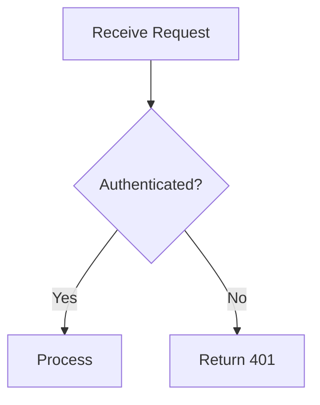

# Documentation Standards

Generic documentation templates and writing standards. For project-specific directory structure and practices, see [docs-structure.md](../../.opencastle/project/docs-structure.md).

## Issue Documentation Template

```markdown
### ISSUE-ID: Brief Description

**Issue ID:** ISSUE-ID
**Status:** Known Limitation | Fixed | Workaround Available
**Severity:** Critical | High | Medium | Low
**Impact:** [What user/developer experience is affected]

#### Problem
[Clear description of the issue]

#### Root Cause
[Technical explanation]

#### Solution Options
1. **Option A** — [Description] — Pros: ... Cons: ...
2. **Option B** — [Description]

#### Related Files
- `path/to/file.ts` — [What it does]
```

## Roadmap Update Template

When a feature is completed:
1. Change status to `COMPLETE` and add completion date
2. List modified files and update the summary table
3. Move to completed section if applicable

## Architecture Decision Record Template

```markdown
## ADR-NNN: Decision Title
**Date:** YYYY-MM-DD
**Status:** Accepted | Superseded | Deprecated
**Context:** [Why this decision was needed]
**Decision:** [What was decided]
**Consequences:** [Impact of the decision]
**Alternatives Considered:** [What else was evaluated]
```

## README Template

```markdown
# Feature / Library Name
One-sentence summary of what this does and why it exists.
## Quick Start
Brief usage example or setup steps.
## Architecture
High-level overview. Include a Mermaid diagram for non-trivial systems.
## Key Files
| File | Purpose |
|------|---------|
| `src/handler.ts` | Request handling logic |
| `src/schema.ts` | Validation schemas |
```

## Mermaid Diagrams

Keep diagrams focused — one concern per diagram.

| Type | Use For | Directive |
|------|---------|-----------|
| Flowchart | Decision logic, pipelines | `flowchart TD` (top-down) / `flowchart LR` (left-right) |
| Sequence | API flows, multi-service interactions | `sequenceDiagram` |
| ER | Data models, relationships | `erDiagram` |



- Add `%% Title: ...` on complex diagrams; use verb labels on arrows
- Limit to 10–12 nodes per diagram; `flowchart TD` for pipelines, `LR` for request flows

## Changelog Entry Template

Group entries by Conventional Commits type under a version heading:

```markdown
## [1.2.0] — YYYY-MM-DD
### Added
- feat: Add retry logic to API client (#123)
### Fixed
- fix: Resolve race condition in queue processor (#127)
### Changed
- refactor: Extract validation into shared module (#125)
```

- One line per change; reference the PR or issue number
- Imperative mood: "Add", "Fix", "Remove" — not "Added", "Fixed"
- Groups: `Added`, `Fixed`, `Changed`, `Removed`, `Deprecated`, `Security`; most recent version first

## Writing & Formatting

- Clear, concise prose; avoid jargon; use relative paths for links; tables for structured data; include "Last Updated" dates
- Archive outdated docs rather than deleting; cross-reference between documents; Mermaid for architecture
- **Headings:** H2 for sections, H3 for subsections; no H1 (auto-generated from title), no H4+
- **Lists:** `-` for bullets, `1.` for numbered; 2-space nested indent
- **Code Blocks:** Fenced with language tag for syntax highlighting
- **Links:** `[text](URL)` with descriptive text and valid URLs
- **Images:** `` with brief alt text
- **Whitespace:** Blank lines between sections; no excessive whitespace
- **Front Matter:** YAML required for instruction/skill files — `title`/`name`, `description`, `applyTo` (instructions: glob of applicable files)

## Pre-Merge Checklist

- [ ] **Accuracy** — all code snippets, file paths, and commands are correct and tested
- [ ] **Completeness** — no TODO placeholders or empty sections remain
- [ ] **Links** — all internal and external links resolve (no 404s)
- [ ] **Front matter** — YAML front matter is present and valid
- [ ] **Formatting** — consistent heading levels, list style, whitespace, and Mermaid renders
- [ ] **Cross-references** — related docs link to each other; "Last Updated" is current

## Anti-Patterns

| Anti-Pattern | Why It's Bad | Do This Instead |
|-------------|-------------|-----------------|
| Wall of text with no headings | Unnavigable; readers skip it | Break into sections with H2/H3 |
| Duplicating content across files | Copies drift; causes confusion | Link to a single source of truth |
| Screenshots without alt text | Inaccessible; breaks when UI changes | Use Mermaid diagrams or describe the UI |
| Documenting implementation details | Becomes stale as code changes | Document intent and contracts |
| Using absolute file paths | Breaks on other machines | Use relative paths from doc location |
| Huge monolithic README | Low signal-to-noise | Split into focused docs, link from README |
| Undated documents | No way to judge currency | Always include "Last Updated" date |
| Using H1 inside document body | Conflicts with auto-generated title | Start body headings at H2 |
